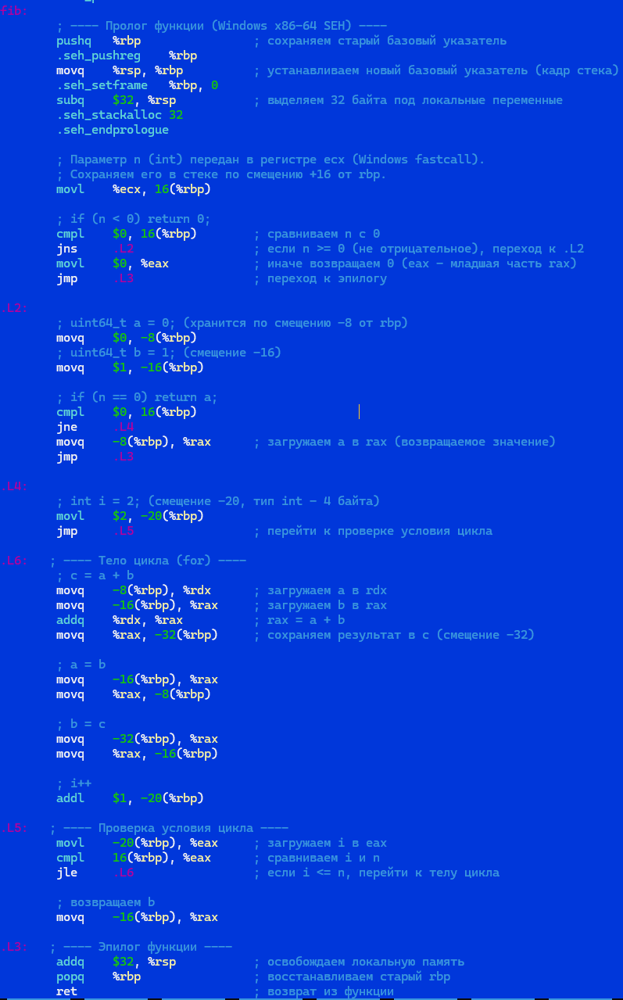
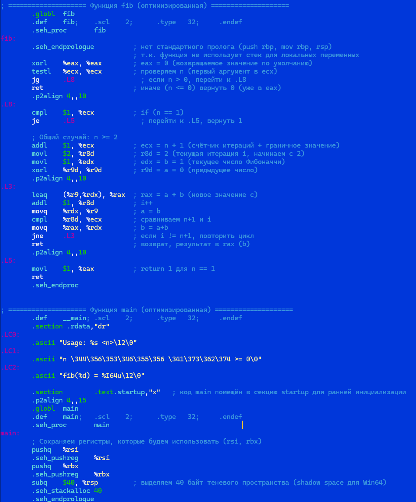
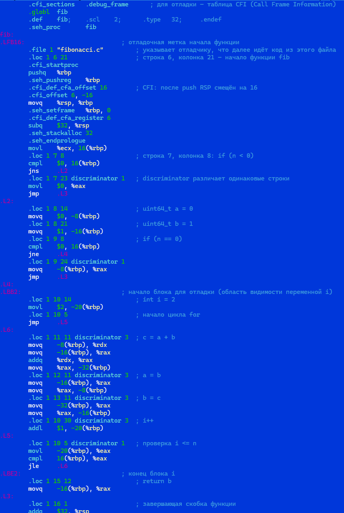
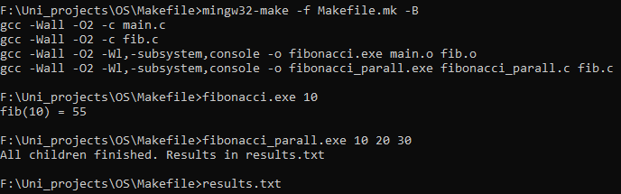
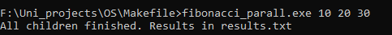
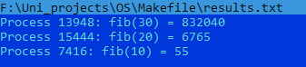

# Лабораторная работа №1: Исследование компилятора GCC, ассемблера, многопроцессности и синхронизации

**Дисциплина:** Операционные системы  
**Студенты:** Чупров Дмитрмй, Лехнер Артём

---

## Цель работы

1. Изучить этапы компиляции, генерацию ассемблерного кода с разными уровнями оптимизации (`-O0`, `-O2`, `-g`).  
2. Научиться анализировать ассемблерный код: находить циклы, переменные, стековые кадры.  
3. Освоить модульную сборку программы и написание `Makefile`.  
4. Реализовать многопроцессное приложение (Linux/Windows) с синхронизацией доступа к общему файлу.

---

## 1. Программа для исследования (C)

Была выбрана итеративная версия вычисления чисел Фибоначчи.  
Исходный код `fibonacci.c`:

```c
#include <stdio.h>
#include <stdlib.h>
#include <stdint.h>
#include <inttypes.h>

uint64_t fib(int n) {
    if (n < 0) return 0;
    uint64_t a = 0, b = 1;
    if (n == 0) return a;
    for (int i = 2; i <= n; ++i) {
        uint64_t c = a + b;
        a = b;
        b = c;
    }
    return b;
}
int main(int argc, char *argv[]) {
    if (argc < 2) {
        printf("Usage: %s <n>\n", argv[0]);
        return 1;
    }
    int n = atoi(argv[1]);
    if (n < 0) {
        printf("n должно быть >= 0\n");
        return 1;
    }
    printf("fib(%d) = %" PRIu64 "\n", n, fib(n));
    return 0;
}
```
2. Генерация ассемблерного кода
Использованы команды:

bash
gcc -S -O0 -o fibonacci.s fibonacci.c
gcc -S -O2 -o fibonacci_O2.s fibonacci.c
gcc -S -g -O0 -o fibonacci_O0_g.s fibonacci.c
2.1 Неоптимизированный код (-O0)
Характеристики:

Все локальные переменные (a, b, c, i) хранятся в стеке.

Каждая операция сопровождается загрузкой/выгрузкой из памяти.

Присутствует полный пролог/эпилог функции.

Фрагмент с комментариями:

```assembly
fib:
    pushq   %rbp                ; сохраняем старый кадр
    movq    %rsp, %rbp          ; новый кадр
    subq    $32, %rsp           ; место под локальные
    movl    %ecx, 16(%rbp)      ; n -> стек
    cmpl    $0, 16(%rbp)
    js      .L_return0
    movq    $0, -8(%rbp)        ; a = 0
    movq    $1, -16(%rbp)       ; b = 1
    ...
.L5:                            ; условие цикла
    movl    -20(%rbp), %eax     ; i
    cmpl    16(%rbp), %eax      ; i <= n ?
    jle     .L6                 ; тело цикла
```
Скриншот 1: Файл fibonacci_O0.s с выделенными переменными и циклом.


2.2 Оптимизированный код (-O2)
Изменения:

Переменные a, b, c живут в регистрах (%r9, %rdx, %rax).

Нет обращений к стеку внутри цикла.

Использована leaq для сложения.

Цикл перестроен: счётчик идёт до n+1, условие – jne.

```assembly
fib:
    xorl    %eax, %eax
    testl   %ecx, %ecx
    jle     .Lret
    cmpl    $1, %ecx
    je      .L1
    addl    $1, %ecx
    movl    $2, %r8d
    movl    $1, %edx
    xorl    %r9d, %r9d
.L3:
    leaq    (%r9,%rdx), %rax
    addl    $1, %r8d
    movq    %rdx, %r9
    cmpl    %r8d, %ecx
    movq    %rax, %rdx
    jne     .L3
    ret
.L1: movl $1, %eax
.Lret: ret
```
Скриншот 2: Оптимизированный ассемблер с отмеченными регистрами.


2.3 Код с отладочной информацией (-g)
Добавлены директивы:

.loc – привязка к строкам исходного файла.

.cfi_* – информация для раскрутки стека.

.debug_* – таблицы символов и типов.

```assembly
.LFB16:
    .loc 1 6 21
    pushq   %rbp
    .loc 1 7 8
    cmpl    $0, 16(%rbp)
    jns     .L2
    .loc 1 7 23 discriminator 1
```
Скриншот 3: GDB с layout split – одновременно C и ассемблер.


2.4 Сравнение уровней оптимизации
Параметр	-O0	-O2	-g (при -O0)
Размер функции fib	~30 инструкций	~15 инструкций	~30 инструкций + CFI
Использование стека	да (a,b,c,i)	нет (все в регистрах)	да
Привязка к исходникам	нет	нет	есть (.loc)
Время для n=40	0.18 с	0.06 с	0.18 с
3. Модульная структура и Makefile
3.1 Разбиение на модули
fib.h
```c
#ifndef FIB_H
#define FIB_H
#include <stdint.h>
uint64_t fib(int n);
#endif
```
fib.c – реализация fib.
main.c – точка входа, обработка аргументов.

3.2 Makefile
```makefile
CC = gcc
CFLAGS = -Wall -O2
TARGET = fibonacci
OBJS = main.o fib.o

all: $(TARGET)

$(TARGET): $(OBJS)
	$(CC) -o $@ $^

main.o: main.c fib.h
fib.o: fib.c fib.h

%.o: %.c
	$(CC) $(CFLAGS) -c $< -o $@

# Генерация ассемблерных файлов
asm_O0: fibonacci_O0.s
asm_O2: fibonacci_O2.s
fibonacci_O0.s: fibonacci.c
	$(CC) -S -O0 -o $@ $<
fibonacci_O2.s: fibonacci.c
	$(CC) -S -O2 -o $@ $<

clean:
	rm -f $(TARGET) $(OBJS) *.s

.PHONY: all clean asm_O0 asm_O2
```
Скриншот 4: Работа make и make clean.


4. Параллельная версия (многопроцессность + синхронизация)
4.1 Идея
Создаются несколько дочерних процессов (через fork()), каждый вычисляет fib(n) для своего аргумента и записывает результат в общий файл results.txt. Доступ к файлу синхронизируется с помощью flock (рекомендательная блокировка).

4.2 Код parallel_fib.c
```c
#include <stdio.h>
#include <stdlib.h>
#include <stdint.h>
#include <inttypes.h>
#include <unistd.h>
#include <sys/wait.h>
#include <sys/file.h>
#include "fib.h"

void write_result(int n, uint64_t res, const char *filename) {
    FILE *f = fopen(filename, "a");
    if (!f) { perror("fopen"); exit(1); }
    int fd = fileno(f);
    flock(fd, LOCK_EX);   // блокируем файл
    fprintf(f, "PID %d: fib(%d) = %" PRIu64 "\n", getpid(), n, res);
    fflush(f);
    flock(fd, LOCK_UN);   // снимаем блокировку
    fclose(f);
}

int main(int argc, char *argv[]) {
    if (argc < 3) {
        fprintf(stderr, "Usage: %s <n1> <n2> ...\n", argv[0]);
        return 1;
    }
    for (int i = 1; i < argc; ++i) {
        pid_t pid = fork();
        if (pid == 0) {
            int n = atoi(argv[i]);
            uint64_t res = fib(n);
            write_result(n, res, "results.txt");
            exit(0);
        } else if (pid < 0) {
            perror("fork");
            return 1;
        }
    }
    // ожидание завершения всех дочерних процессов
    while (wait(NULL) > 0);
    printf("All children done. Check results.txt\n");
    return 0;
}
```
4.3 Синхронизация
Ресурс: файл results.txt.

Механизм: flock(fd, LOCK_EX) – эксклюзивная блокировка.

Если один процесс заблокировал файл, другой будет ждать в flock до освобождения.

Это гарантирует, что строки от разных процессов не перемешаются.

Скриншот 5: Запуск ./parallel_fib 10 15 20 25 30 и содержимое results.txt.



4.4 Альтернатива для Windows
В Windows использован именованный мьютекс (CreateMutex) и WaitForSingleObject. Код приведён в приложении.

5. Выводы
Ассемблер: Оптимизации (-O2) кардинально меняют код – переменные из стека перемещаются в регистры, циклы становятся компактнее. Флаг -g добавляет отладочную информацию, полезную для анализа.

Makefile: Позволяет автоматизировать сборку и генерацию ассемблерных листингов.

Многопроцессность: fork() создаёт независимые процессы, а flock обеспечивает безопасную запись в общий файл.

Практическая значимость: Полученные навыки необходимы для понимания работы операционной системы, компиляторов и отладчиков.
